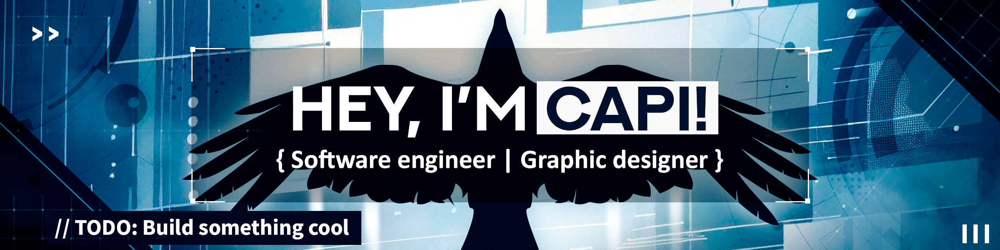

  

## About me
I'm a software developer who enjoys turning ideas into full-stack web applications, everyday tools, game engines, and AI-powered projects.  
I also have experience in graphic design and digital illustration using Adobe Photoshop, Illustrator, and Premiere Pro.

## Technologies

### Languages and Web

### Frameworks and Runtime

### Tools and Platforms

## Currently Exploring

**Web Architecture** — Scalable full-stack application design  
**Chess Engines** — NNUE evaluation and engine strength  
**Applied LLMs** — Tool use and agent-like applications
